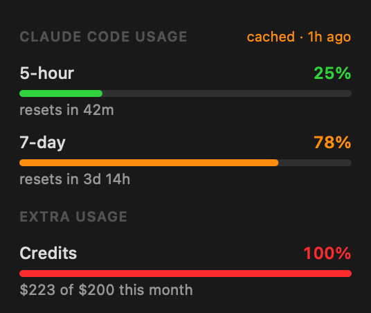
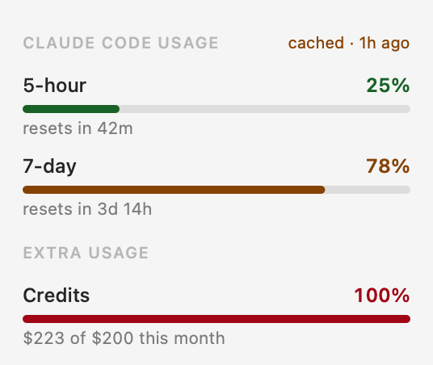

# claude-usage-bar

A macOS menu bar app showing how much of your Claude Code rate limits you've used.

Menu bar shows the **binding** constraint — whichever window is closest to its limit:

```
7d 79%
```

Black under 70%, orange at 70%+, red at 90%+. The warning colours resolve to
darker variants on a light menu bar, where macOS's `systemOrange` only reaches
2.2:1 contrast against white. A `~` prefix means the number is
stale (read from cache, see below). Clicking opens a breakdown with a progress track per window:

| Dark | Light |
|---|---|
|  |  |

Track colours are independent of the menu bar text: green under 70%, amber at
70%+, red at 90%+, each resolving to a darker variant in Light Mode.

## Data source

Polls `https://api.anthropic.com/api/oauth/usage` every 5 minutes — the same endpoint
`/usage` uses inside Claude Code. The OAuth token is read fresh on each poll from
the `Claude Code-credentials` Keychain item, via `/usr/bin/security`, so token
rotations by Claude Code are picked up automatically and no credential is stored
by this app.

If the API call fails (no token, expired token, offline), it falls back to
`cachedUsageUtilization` in `~/.claude.json`, which Claude Code refreshes while
it runs. That value can be well over an hour old, so the bar marks it with `~`
and the menu says `cached`.

Opening the menu never triggers a fetch — only the 5-minute timer and **Refresh
Now** do. The endpoint rate-limits at roughly one request per minute and returns
`Retry-After` on 429; that header is honoured rather than guessed at, and the app
falls back to the cache (marked `~`) meanwhile.

## Build / install

```bash
./build.sh          # compiles and installs to /Applications/ClaudeUsage.app
open -a ClaudeUsage
```

Requires only the Xcode Command Line Tools (`swiftc`). No dependencies, no Xcode
project. Enable **Open at Login** from the menu to have it start with the Mac.

## Debugging

The macOS status bar is invisible to `screencapture`, so the binary has a
headless mode that prints exactly what the menu would show:

```bash
ClaudeUsage --dump                 # print what the menu bar shows
ClaudeUsage --dump --cache-only    # exercise the offline fallback path
ClaudeUsage --render               # write the menu UI to /tmp/menu-{dark,light}.png
```

(`ClaudeUsage` = `/Applications/ClaudeUsage.app/Contents/MacOS/ClaudeUsage`.)

`--render` draws the menu views offscreen in both appearances, which is the only
way to check the layout — macOS status items and their menus do not appear in
`screencapture` output.
